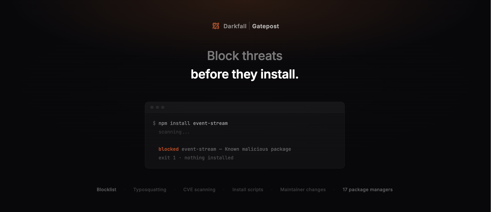

<h3 align="center">Supply chain security for every package manager.</h3>

<p align="center">
  Scans every install for malware, typosquats, CVEs, hijacked maintainers, and suspicious install scripts — before anything touches your machine.
</p>

<p align="center">
  <b>Zero dependencies. Zero config. Zero friction.</b>
</p>

<p align="center">
  <code>npm install -g @getbastionai/gatepost</code>
</p>

---

## What it catches

| Check | Description | Default |
|---|---|---|
| **Blocklist** | Known malicious packages (89+ entries) | Block |
| **Typosquat detection** | Levenshtein distance against popular packages | Warn |
| **CVE scanning** | Live vulnerability lookup via [OSV.dev](https://osv.dev) | Warn |
| **Package age** | Flags packages published less than 24 hours ago | Warn |
| **Install scripts** | Detects `preinstall` / `postinstall` hooks | Warn |
| **Maintainer change** | Flags when the latest version has a new publisher | Warn |

Every check runs in parallel. Clean packages pass through silently.

---

## 17 package managers

| Ecosystem | Managers |
|---|---|
| **Node / JS** | `npm` `npx` `yarn` `pnpm` `pnpx` `bun` `bunx` |
| **Python** | `pip` `pip3` `uv` `poetry` `pipx` `python -m pip` |
| **Ruby** | `gem` |
| **Rust** | `cargo` |
| **PHP** | `composer` |
| **Elixir** | `mix` |
| **Dart / Flutter** | `pub` |

---

## Install

```sh
npm install -g @getbastionai/gatepost
```

That's it. Shell aliases are configured automatically. Restart your terminal and every package manager is protected.

<details>
<summary>Other install methods</summary>

**curl**

```sh
curl -fsSL https://raw.githubusercontent.com/GetDarkfall/Gatepost/master/install.sh | sh
```

**From source**

```sh
git clone https://github.com/GetDarkfall/Gatepost.git
cd Gatepost
npm install -g .
```

</details>

---

## Usage

Use your package managers exactly as you normally would:

```sh
npm install lodash
pip install requests
python -m pip install flask
cargo add serde
gem install rails
```

When a package is clean, Gatepost is invisible. When something is wrong:

```
gatepost: install blocked

  blocked  event-stream  Known malicious package
```

Exit code 1. Nothing was installed.

Warnings print but don't block:

```
gatepost: warning

  warn  lodahs  Possible typosquat of "lodash"
```

---

## Manual check

Scan packages without installing them:

```sh
gatepost check express axios lodash
```

```
  ok       express
  ok       axios
  ok       lodash

All packages look clean.
```

---

## Audit lockfiles

Scan your project's dependency files in one command:

```sh
gatepost audit
```

Parses `package.json`, `requirements.txt`, `Gemfile`, `Cargo.toml`, `composer.json`, `mix.exs`, and `pubspec.yaml` automatically.

```sh
gatepost audit --json    # Machine-readable output for CI
```

---

## CI/CD

```yaml
# GitHub Actions
- run: npm install -g @getbastionai/gatepost
- run: gatepost setup --ci
- run: export PATH="$HOME/.gatepost/bin:$PATH"
```

Works with GitHub Actions, GitLab CI, CircleCI, Jenkins, Azure Pipelines, and Bitbucket.

PATH shims in `~/.gatepost/bin` replace shell aliases in non-interactive environments.

**JSON output** for pipeline integration:

```sh
gatepost check express --json
gatepost audit --json
```

---

## Configuration

```sh
gatepost init
```

Interactive setup creates `~/.gatepostrc`:

```json
{
  "checks": {
    "blocklist": true,
    "typosquat": true,
    "vulnerability": true,
    "age": true,
    "scripts": true,
    "maintainer": true
  },
  "age": { "minimumDays": 1, "action": "warn" },
  "blocklist": { "action": "block", "custom": [] },
  "allowlist": [],
  "failOpen": true,
  "logLevel": "normal"
}
```

| Option | What it does |
|---|---|
| `checks.*` | Toggle individual checks on/off |
| `age.minimumDays` | How old a package must be (default: 1 day) |
| `*.action` | Set to `"warn"` or `"block"` per check |
| `blocklist.custom` | Add your own blocked package names |
| `allowlist` | Skip all checks for specific packages |
| `failOpen` | Proceed on network failure (default: true) |
| `logLevel` | `"silent"` / `"normal"` / `"verbose"` |

CLI flags override config: `--silent`, `--verbose`, `--json`

---

## Commands

| Command | Description |
|---|---|
| `gatepost setup` | Add shell aliases (run once after install) |
| `gatepost setup --ci` | Install PATH shims for CI/CD |
| `gatepost remove` | Remove aliases and CI shims |
| `gatepost init` | Interactive config setup |
| `gatepost check <pkg...>` | Scan packages without installing |
| `gatepost audit [dir]` | Scan lockfiles and manifests |
| `gatepost <manager> [args]` | Run any manager with protection |

---

## How it works

1. Shell aliases redirect `npm install foo` -> `gatepost npm install foo`
2. Gatepost extracts package names from the arguments
3. Six checks run in parallel against each package
4. Blocked = exit 1, nothing installs
5. Warned = prints to stderr, install continues
6. Clean = silent passthrough to the real binary

Network failures warn and proceed by default. Gatepost never breaks your workflow.

---

## Shells supported

Zsh, Bash, Fish, Ksh, Tcsh, PowerShell, PowerShell Core

---

## Uninstall

```sh
gatepost remove
npm uninstall -g @getbastionai/gatepost
```

---

## License

AGPL-3.0
