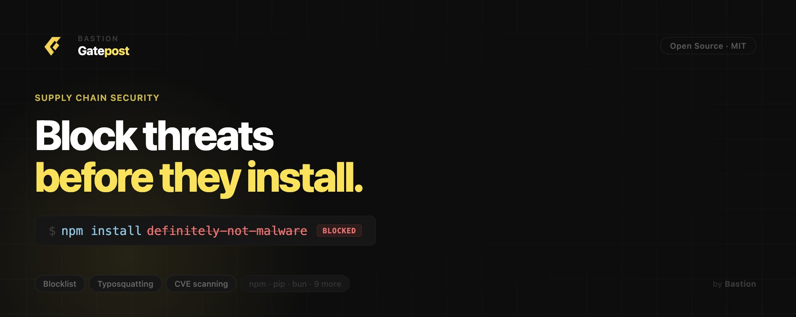

# Gatepost

**Gatepost** wraps your package managers and scans every install for malicious packages — before they touch your machine.

Every install is checked against three layers of protection:

| Check | What it catches |
|---|---|
| **Blocklist** | Known malicious packages by name |
| **Typosquat detection** | Lookalikes of popular packages (e.g. `lodahs` → `lodash`) |
| **CVE scanning** | Live vulnerability lookup via the [OSV.dev](https://osv.dev) API |

If a package is flagged, the install is blocked. If it's clean, Gatepost steps aside — zero friction, zero overhead.

---

## Supported package managers

| Ecosystem | Managers |
|---|---|
| **Node / JS** | `npm`, `npx`, `yarn`, `pnpm`, `pnpx`, `bun`, `bunx` |
| **Python** | `pip`, `pip3`, `uv`, `poetry`, `pipx` |

---

## Installation

```sh
npm install -g gatepost-sec
```

That's it. Shell aliases are set up automatically — restart your terminal and every package manager command is protected.

---

## Usage

After install, use your package managers exactly as you normally would:

```sh
npm install lodash
yarn add axios
pip install requests
bun add hono
npx create-react-app my-app
uv add fastapi
```

Gatepost runs silently when everything is clean. Output only appears when something is flagged.

### Blocked install

```
gatepost: install blocked

  blocked  event-stream  Known malicious package
```

The install exits with code 1. Nothing was installed.

### Warning (install proceeds)

```
gatepost: warning

  warn  lodahs  Possible typosquat of "lodash"
```

Warnings are shown but the install is not blocked — you decide.

---

## Manual check

Scan packages without installing them:

```sh
gatepost check express axios lodash
```

```
  ok       express
  ok       axios
  ok       lodash

All packages look clean.
```

---

## Commands

| Command | Description |
|---|---|
| `gatepost setup` | Add shell aliases (run once after install) |
| `gatepost remove` | Remove shell aliases |
| `gatepost check <pkg...>` | Scan packages without installing |
| `gatepost <manager> [args]` | Run any manager with protection |

---

## How it works

1. Shell aliases silently redirect `npm install foo` → `gatepost npm install foo`
2. Gatepost extracts package names from the command arguments
3. Three checks run in parallel: blocklist lookup, typosquat similarity, OSV CVE query
4. Blocked packages exit with code 1 — nothing installs
5. Warnings print to stderr but allow the install to continue
6. Clean packages pass straight through to the real package manager

If the OSV network request fails (offline or timeout), Gatepost warns and proceeds — it never blocks a legitimate workflow.

---

## Uninstall

```sh
gatepost remove
npm uninstall -g gatepost-sec
```

---

## Requirements

- Node.js 16+
- npm (for global install)

---

## License

MIT
